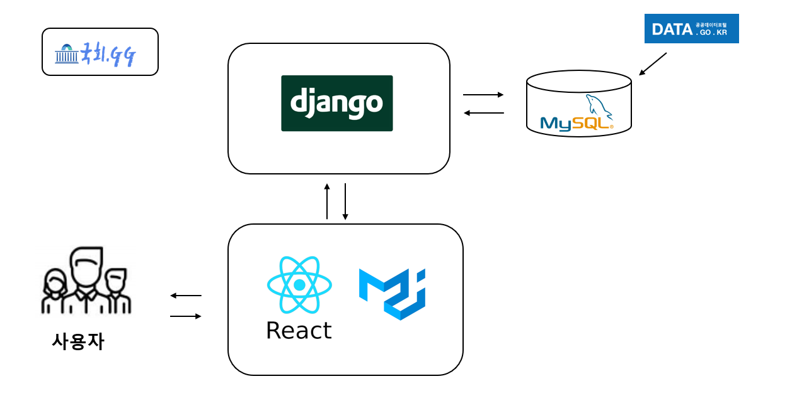
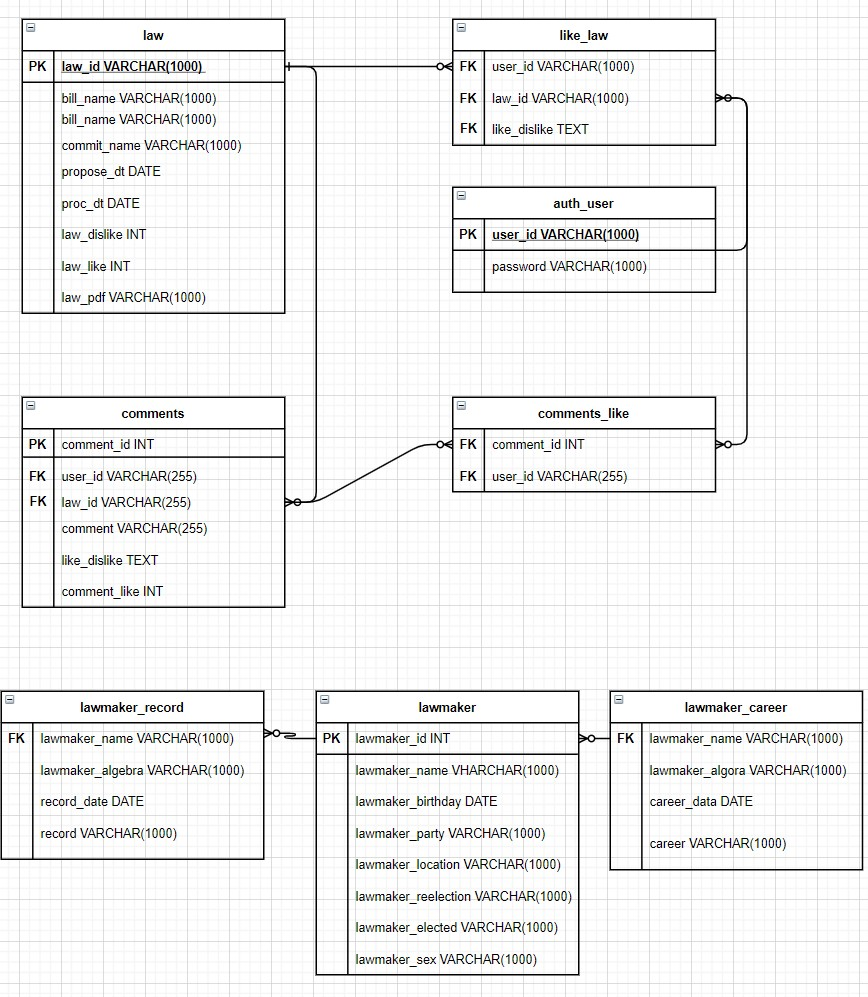

# 국회 정보 토론 서비스 : 국회.GG

#### 

## 📄 개요

- **국회사무처 의안정보 공공데이터를 이용한 국회의안, 국회의원 정보제공 및 의안토론 서비스**

    최근 발의되는 법을 쉽게 접하기 힘든 사회적 문제를 해결하고 법안에 대한 다양한 의견을 한곳에서 공유할 수 있도록 공공데이터를 이용하여 국회의원들이 발의하는 법안을 보여준다. 또 한 찬성 반대 투표와 댓글을 통한 찬반 토론이 가능한 시스템을 개발 하였고   현재 국회의원들을 검색하여 정보들을 제공하는 서비스이다.

## 🖥 실행 화면

(gif)

## 🗂 시스템 구성도

## 📔 DB 구조

DB테이블 자료형 및 API 명세서는 [국회.GG 노션 ](https://www.notion.so/gg-95d771eb23cf4888894a4f8f23908c10) 을 확인해 주세요.

## 🧑‍💻 팀 소개

### 백엔드

#### 손태균 [@stg0123](https://github.com/stg0123)

#### 이효준 [@leehj8896](https://github.com/leehj8896)

#### 허준현 [@denhur62](https://github.com/denhur62)

### 프론트엔드

#### 이재웅 [@QuiD-0](https://github.com/QuiD-0)

#### 전세환 [@NormalPlayerJSH](https://github.com/NormalPlayerJSH)

#### 임준섭 [@junseublim](https://github.com/junseublim)